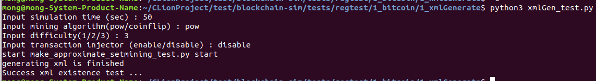
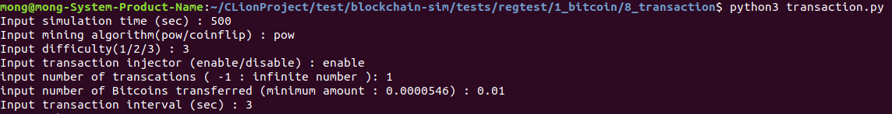

# release 0.1.0 regression test 진행 프로세스 설명 및 사용법

## regression tests:
  + xml 파일 생성 test
  + shadow 실행 test
  + bitcoin 실행 test
  + bitcoin 난이도 조정 test
  + bitcoin wallet address test
  + bitcoin mining test
  + bitcoin main chain test
  + bitcoin transaction 생성 test
  + bitcoin transaction count test
  + bitcoin initial coin test <br><br>

### 1. xml 파일 생성 test <br>

: shadow는 밑에 명령어 처럼 시뮬레이션 디자인을 xml파일로 정의를 하여, 정의된 xml파일과 함께 실행을 해야함. 실행할 xml 파일을 생성하기 위해서 xml 생성기가 필요하며, 본 test는 생성기를 통해 xml 파일이 제대로 만들어졌나 확인하기 위한 test. <br><br>
```bash
shadow example.xml
```
<br>실행 프로세스<br><br>
 <br><br>
1-1) 시뮬레이션 시간 입력 <br>
1-2) 마이닝 알고리즘 입력 <br>
1-3) 비트코인 난이도 입력 <br>
1-4) 트랜잭션 injector 활성화 여부 입력 (단, transaction test가 포함되는 8,9 부터만 활성화 기능이 작동함) <br><br>


### 2. shadow 실행 test

: 1번 test에서 생성된 xml을 갖고 shadow 실행을 시작함. 정상적으로 실행이 되었으면, shadow의 log가 shadow.data 디렉토리에 생성이 됨. 실행 프로세스는 1번 과정과 같으며, 마지막에 shadow.data디렉토리에 로그 데이터가 생성이 되었으면 return 0, 아닐경우 return -1<br><br>

### 3. bitcoin 실행 test
: bitcoin이 시뮬레이션이 정상적으로 작동한지 확인하기 위한 test임. 2번 test를 그대로 사용을 하여, 시뮬레이션된 bitcoin의 결과 로그의 생성 여부를 확인하고, (shadow 결과 로그가 아님) xml 파일에서 설정된 plugin 파라미터 값과 bitcoin 결과 로그 값에 적요이 되었는지 확인. 전부 적용이 되었다면 return 0, 아닐 경우 return -1 <br><br>

### 4. bitcoin 난이도 조정 test
: 시뮬레이션한 bitcoin이 설정된 난이도가 잘 적용된지 확인하기 위한 test. 2번 test를 그대로 사용을 하며, 1번 test (xml 파일 생성)에서 1-3 콘솔 입력 값이 시뮬레이션할 bitcoin의 난이도 설정 값임. 1-3에서 정의된 난이도는 3가지가 있으며, 난이도는 mainnet, testnet, mainnet과 testnet의 중간 이렇게 있음. 시뮬레이션된 bitcoin의 결과 로그에서 설정된 난이도와 1-3에서 설정한 난이도 값이 같으면 return 0, 아닐 경우 return -1 <br><br>

### 5. bitcoin wallet address test
: 시뮬레이션 과정에서 생성된 bitcoin wallet이 제대로 생성되었는지 확인하는 test. 2번 test를 그대로 사용을 하며, 지갑 주소를 생성하게 하는 rpc request가 정의된 플러그인이 xml파일에 추가가 되어있음. 그렇기에 시뮬레이션이 실행이되면 bitcoin의 지갑주소가 생성됨. 생성된 지갑 주소는 rpc request가 구현된 plugin의 결과 로그 값에 남겨짐. 남겨진 지갑주소의 크기가 "35" 이면 return 0, 아닐 경우 return 1 <br><br>

### 6. bitcoin mining test
: 시뮬레이션 동안 mining이 잘 수행된지 확인하기 위한 test. 5번 test를 그대로 사용을 하여, rpc request가 구현된 plugin에 mining request를 추가하여 시뮬레이션을함. 시뮬레이션 후, 생성된 bitcoin 결과 로그 값의 마지막 "updatetip"값이 0이 아닐 경우 return 0, 그렇지 않을 경우 return 1. <br><br>

### 7. bitcoin main chain test
: 시뮬레이션된 bitcoin의 main chain이 제대로 적용된지 위한 test. 2번 test를 그대로 사용을 하여, rpc request에 "getblockchaininfo" 함수 요청이 정의된 플러그인과 함께 시뮬레이션을 함. 시뮬레이션 후, 생성된 bitcoin 결과 로그 값은 getblockchaininfo 의 return 값이고, 이 값은 json 형식으로서 "bestblockhash"키 값에 해당되는 값과 시뮬레이션된 bitcoin의 결과 로그 값 중 "genesishash" 값이 일치하면 return 0, 아닐 경우 return 1 <br><br>

### 8. bitcoin transaction 생성 test
 <br>
: 시뮬레이션 과정에서 transaction이 생성된지 확인하기 위한 test. 지금까지는 transaction injector의 활성화 여부를 전부 비활성화로 적용을 하고 test를 했음. (transaction injector가 xml에 정의가 안되었기에) xml파일에 transaction injector 정의의 기준은 해당 경로에 "trnasaction.so" 라는 플러그인 파일이 존재를 할 경우에 활성화/비활성화 여부가 결정이 됨. 즉 8,9번 test는 해당 경로에 "transaction.so" 파일이 존재하기에, "python3 transaction.py"의 4번째 콘솔 입력 값에 "enable"을 할 수 있음. (그림 참고) 해당 시뮬레이션이 끝나면, transaction이 생성된지 여부를 확인을 함. transaction injector plugin의 실행 로그 값 중 "error"를 기준으로 필터링을 하여, 없으면 return 0, 있으면 return 1. <br><br>

### 9. bitcoin transaction count test
: "python3 transaction_count.py" 의 트랜잭션 개수 입력 콘솔에 입력된 값과 시뮬레이션 결과 생성된 transaction 개수가 일치한지 확인하기 위한 test. 8번 test를 그대로 사용을 함. 만약 콘솔에서 트랜잭션 개수를 -1로 설정을 하면 max tps를 측정하기 위한 셋팅으로서, 그 뒤에 설정된 tx interval, bitcoin amount 값들은 default로 설정된 값이 셋팅이 되어 바로 실행이 됨. default의 값으로 amount는 최소량 비트코인(0.000000546)으로 설정하였고, tx interval은 1로 설정을 함. 그렇기에 트랜잭션 개수를 -1로 설정을 하면 개수 측정을 하는 test는 제대로 동작할 수 없음. 그렇기에 개수가 -1이 아닌 1이상의 개수가 셋팅이 될 때 테스트가 진행이 됨. 시뮬레이션이 종료되면, bitcoin 실행 로그 결과 중 마지막 "updatetip"의 coinbase tx를 제외한 tx의 개수와 mempool에 존재하는 tx 갯수를 더한 값이 bitcoind의 결과 로그 중 "sendtoaddress"의 갯수와 같으면 return 0, 아닐 경우 return -1

### 10. bitcoin initial coin test

: dummy tx 주입을 위한 기능 test. 이를 위해 bitcoin의 블록 타당성 룰을 수정함. 원래의 룰은 100개 블록을 기준으로 정당한 tx가 생성이 될 수 있었는데, 이 기준을 6개로 줄여서, 굳이 100개의 블록을 채굴할 필요 없이 6개의 블록 채굴 이후로 initial coin 준비를 할 수 있음. 또한 1번째 블록의 트랜잭션에서 5만개의 bitcoin을 생성해주는 트랜잭션이 담겨있기에, 7번째 블록이 생성됨과 동시에 initial coin이 생성될 지갑주소에 5만개의 비트코인이 셋팅이 됨. test는 mining rpc request가 없음에도 블록이 생성이되었나 확인을 함. 생성이 되었으면 return 0, 아닐 경우 return 1