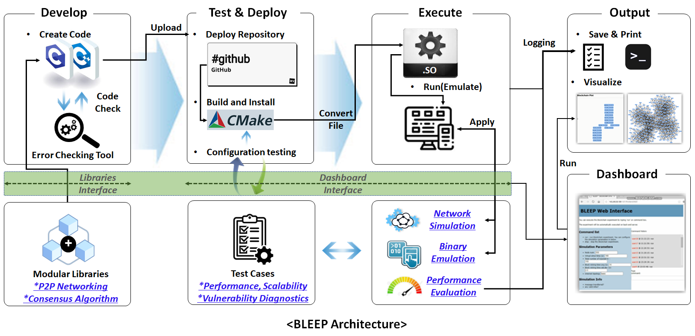

# Introduction to BLEEP
블록체인은 여러가지 기술의 융합을 통해 구현되며 각각의 기술이 수많은 경우의 수를 가지기 때문에 동작을 분석 및 검증하기가 어렵다.  
BLEEP을 이용한다면 다양한 블록체인 어플리케이션의 실제 동작을 단일 머신에서 대규모로 테스트할 수 있다.  
또한 제공하는 테스트 프레임워크를 이용해 성능(TPS, Latency) 및 보안(Sybil)과 관련한 다양한 시나리오를 구성하여 테스트 할 수 있다.  

블록체인의 범위는 현재 C/C++기반 블록체인 기반기술을 대상으로 하며, 향후에는 다양한 언어로 구현된 블록체인과  
이를 이용하는 어플리케이션까지 확장하고자 한다.   

- 이를위해 BLEEP은 다음과 같은 핵심 목표를 추구하고 있으며,
  - [(1) 다양한 언어로 구현된 블록체인 바이너리의 동작을 에뮬레이션](Intro-Overview.md#1-blockchain-emulationtesting-platform)
  - [(2) 블록체인 동작 검증을 위한 기능 및 성능, 취약성 등의 테스팅 환경 제공](Intro-Overview.md#2-blockchain-evaluationtesting-platform)

- 현재 아래와 같이 2개의 핵심 컴포넌트로 제공하고 있다. 

  - shadow (Blockchain Emulator/Simulator) : 
    * [https://github.com/kaistshadow/blockchain-sim/tree/master/shadow](https://github.com/kaistshadow/shadow)

  - BLEEPemul (Blockchain Emulation) : 
    * [https://github.com/kaistshadow/blockchain-sim/tree/master/BLEEPemul](https://github.com/kaistshadow/blockchain-sim/tree/master/BLEEPemul)

- BLEEP은 그림1과 같이 설계 되었고,
  - 블록체인 개발자가 "개발-테스트 및 배포-실행-결과"의 4단계를 통해 실제 블록체인 어플리케이션의 동작을 검증
  - 구현 및 테스팅을 위한 라이브러리 인터페이스와 대시보드 인터페이스
  - 로깅 작업을 통해 결과를 저장 및 출력(시각화 등)

- CMake 빌드 시스템을 이용해 구조화 되어 있으며, 각 폴더의 역할은 아래와 같다.  
  - 네트워크 시뮬레이터 및 바이너리 에뮬레이터
    - `Shadow` : Shadow는 Tor 네트워크의 동작을 시뮬레이션 하기 위한 오픈 프로젝트이며, BLEEP팀은 Shadow를 기반으로 블록체인의 에뮬레이션 환경을 제공
  - 블록체인 노드 Emulation 테스트
    - `BLEEPemul` : 현재 비트코인 노드에 대한 채굴, 트랜잭션, 노드 확장 등을 에뮬레이션할 수 있는 프레임워크를 제공(자동화된 스크립트 코드 제공)
  - 블록체인 노드 Evaluation 테스트
    - `BLEEPeval` : 블록체인의 구현체의 동작을 평가하기 위한 보안성, 성능 등을 테스트할 수 있는 프레임워크를 제공
  - BLEEP 인스톨 파일
    - `Install`
      - BLEEP에서 공통적으로 사용하는 플러그인, 라이브러리, 헤더파일, CMake파일 등을 제공   

# (1) Blockchain emulation(testing) platform 

BLEEP은 임의의 블록체인 프로그램의 동작을 에뮬레이션할 수 있는 테스트 프레임워크를 제공한다.
BLEEP을 이용해, 블록체인 개발자들은 자신들이 개발한 혹은 사용하고자하는 임의의 블록체인에 대하여 블록체인의 채굴, 트랜잭션 생성 및 전파 등을 테스트할 수 있다. 
블록체인 에뮬레이션을 위한 프레임워크는 아래의 기능들을 제공하는 것을 목적으로 한다.
* 1\~10개의 노드로 이루어진 소규모 블록체인 네트워크부터 1000\~10000개의 노드로 이루어진 대규모 네트워크까지 하나의 플랫폼 상에서 동작시키는 기능
* 블록체인(비트코인) 노드에게 채굴 등의 메시지를 보내는 RPC 노드 지원 
* 블록체인(비트코인) 노드의 채굴, 트랜잭션 등의 동작을 모니터링하는 노드 지원
* 블록체인(비트코인) 에뮬레이션을 동작을 지원(노드 개수, 시뮬레이션 시간, 마이닝 방법, 난이도, 트랜잭션 생성 유무 등)하는 스크립트 코드 지원 

